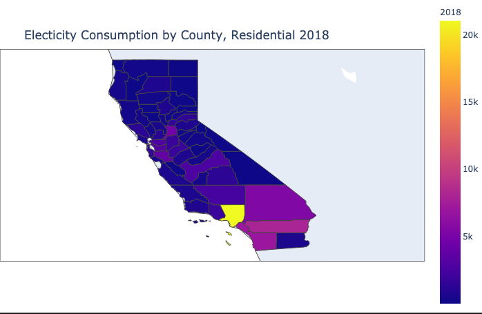
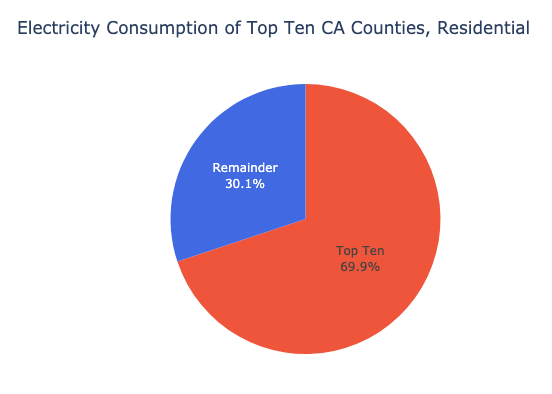
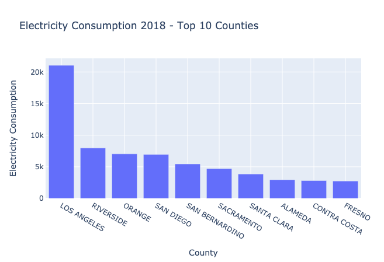
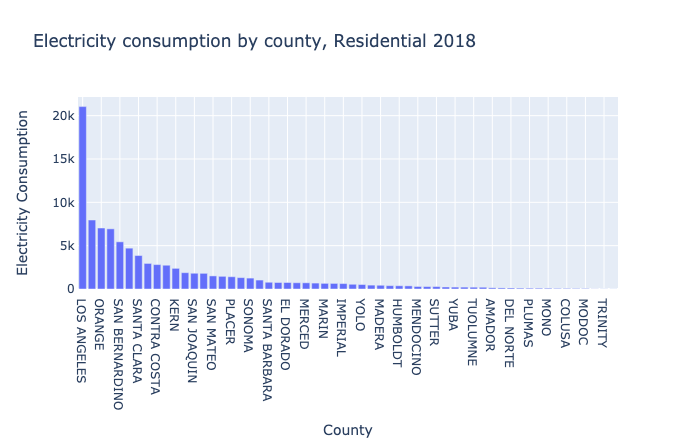
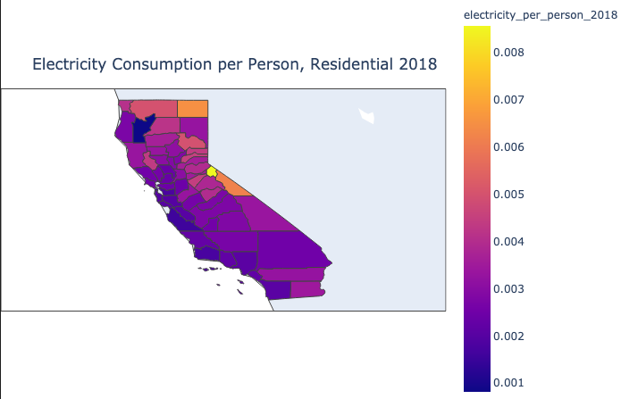
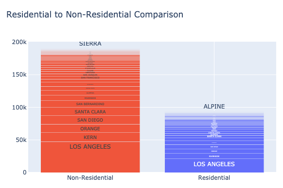

# Energy Consumption by California County

As California forces rolling blackouts on its constituents, we must look at two sources of aggravation to the power grid. Firstly, California's power source must be questioned with particular focus on the stability of this source. Secondly, the consumption habits of each county must be questioned. This second point guides us in choosing counties to concentrate energy reform.

This project is a brief look into the second issue: energy consuption by county. This brief look may lead to further evaluation into which counties should be targeted to decrease overall energy expenditure in CA.

## The Data

This report uses data from the state of California in 2018.  
Source: http://www.ecdms.energy.ca.gov/elecbycounty.aspx  

## Visuals

For non-native Californians, this map highlights the population distribution across the state. Los Angeles and San Diego counties show in the southern region, and San Fransisco shows along the central coast. Energy consumption is highly correlated with population.

The 10 largest energy consumers shown in the map above are responsible for 69.9% of all residential energy consumption in CA in 2018.

This plot names all 10 counties accounting for 69.9% of residential energy consumption in CA in 2018.

The top 10 counties dwarf the rest.

The map of energy consumption per person is nearly inverted from the map of total consumption by county. This map implies that factors other that total consuption should be considered in which counties should be targeted to decrease overall energy expenditure in CA.

Energy consumption from business and other non-residential consumers is compared to residential energy consumption. The 5 largest consuming counties on the left use more energy than the entire state's residential consumption.